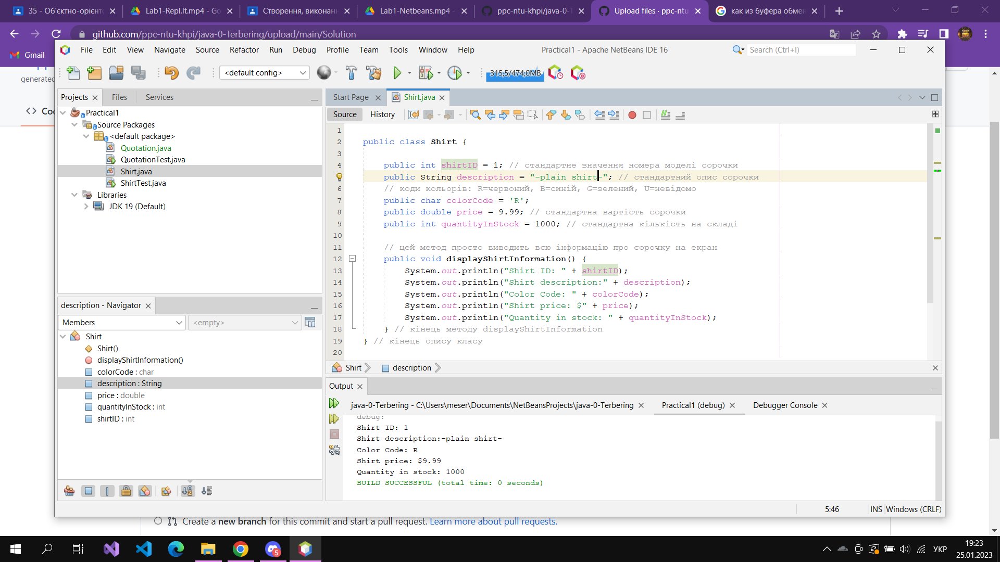
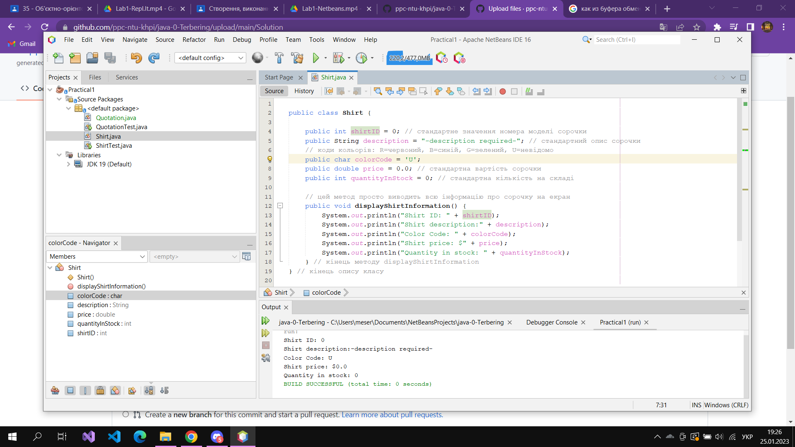

## Завдання 1. Створення та запуск першої програми (сорочки)

**1.Початковий код програми.**

``` java
public class Shirt {
  public int shirtID = 0; 
  public String description = "-description required-"; 
  // коди кольорів: R=червоний, B=синій, G=зелений, U=невідомо
  public char colorCode = 'U';
  public double price = 0.0; 
  public int quantityInStock = 0; 
  

  public void displayShirtInformation() {
    System.out.println("Shirt ID: " + shirtID);
    System.out.println("Shirt description:" + description);
    System.out.println("Color Code: " + colorCode);
    System.out.println("Shirt price: $" + price);
    System.out.println("Quantity in stock: " + quantityInStock);
  } 
} 
```


**2.Перероблений код програми.**

``` java
public class Shirt {

    public int shirtID = 1; 
    public String description = "-plain t-shirt-"; 
    // коди кольорів: R=червоний, B=синій, G=зелений, U=невідомо
    public char colorCode = 'R';
    public double price = 9.99; 
    public int quantityInStock = 1000; 

   
    public void displayShirtInformation() {
        System.out.println("Shirt ID: " + shirtID);
        System.out.println("Shirt description:" + description);
        System.out.println("Color Code: " + colorCode);
        System.out.println("Shirt price: $" + price);
        System.out.println("Quantity in stock: " + quantityInStock);
    } 
} 
```

